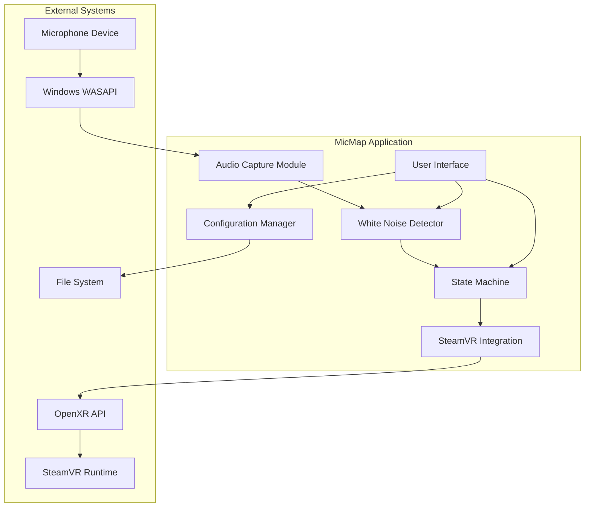
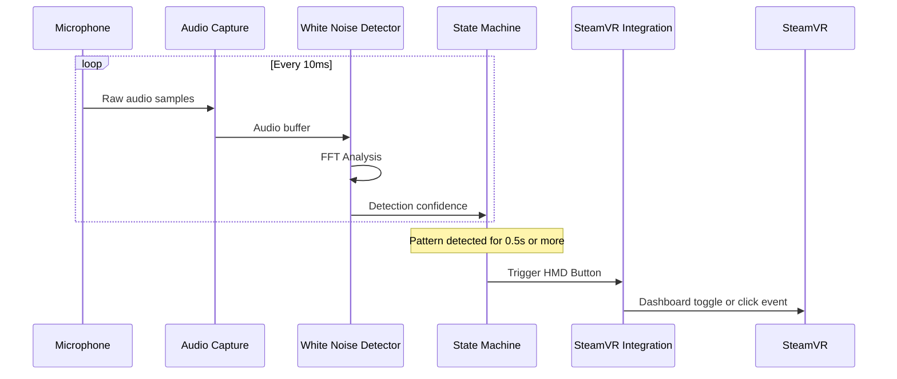
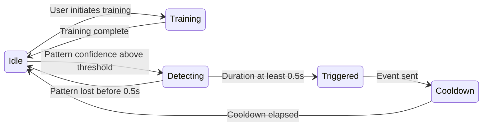

# MicMap Architecture Document

## Table of Contents
1. [Overview](#overview)
2. [System Architecture](#system-architecture)
3. [Module Design](#module-design)
4. [Technology Stack](#technology-stack)
5. [Project Structure](#project-structure)
6. [Build System](#build-system)
7. [Technical Challenges and Solutions](#technical-challenges-and-solutions)
8. [Development Stages](#development-stages)
9. [Configuration and Persistence](#configuration-and-persistence)

---

## Overview

### Purpose
MicMap is a SteamVR add-on that enables hands-free interaction by detecting when a user covers their microphone with their finger. The characteristic white noise pattern created by this action is detected and translated into SteamVR input events.

### Key Features
- **Microphone Monitoring**: Captures audio from a configurable input device (default: first device containing "Beyond" in the name)
- **Non-blocking Audio Capture**: Uses WASAPI shared mode to allow other applications to use the same microphone simultaneously
- **White Noise Pattern Recognition**: Trains on and detects the unique sound pattern created when covering a microphone
- **SteamVR Integration**: Sends HMD button events to toggle dashboard or trigger custom actions
- **Persistent Training**: Saves trained patterns to disk for use across sessions

### Target Platform
- Windows 10 and Windows 11
- SteamVR with OpenXR runtime

---

## System Architecture

### High-Level Component Diagram



### Data Flow Diagram



### State Machine



---

## Module Design

### 1. Audio Capture Module

#### Responsibilities
- Enumerate available audio input devices
- Select device by name pattern matching (default: "Beyond")
- Capture audio in shared mode (non-exclusive)
- Buffer audio samples for processing
- Handle device disconnection/reconnection

#### Interface

```cpp
namespace micmap::audio {

struct AudioDevice {
    std::wstring id;
    std::wstring name;
    uint32_t sampleRate;
    uint16_t channels;
    uint16_t bitsPerSample;
};

class IAudioCapture {
public:
    virtual ~IAudioCapture() = default;
    
    // Device enumeration
    virtual std::vector<AudioDevice> enumerateDevices() = 0;
    virtual bool selectDevice(const std::wstring& namePattern) = 0;
    virtual bool selectDeviceById(const std::wstring& deviceId) = 0;
    
    // Capture control
    virtual bool startCapture() = 0;
    virtual void stopCapture() = 0;
    virtual bool isCapturing() const = 0;
    
    // Audio data access
    virtual bool getAudioBuffer(std::vector<float>& buffer) = 0;
    virtual AudioDevice getCurrentDevice() const = 0;
    
    // Callbacks
    using AudioCallback = std::function<void(const float*, size_t)>;
    virtual void setAudioCallback(AudioCallback callback) = 0;
};

// Factory function
std::unique_ptr<IAudioCapture> createWASAPICapture();

} // namespace micmap::audio
```

#### Implementation Details
- Uses WASAPI (Windows Audio Session API) in **shared mode**
- Shared mode allows multiple applications to access the same audio device
- Captures audio in a separate thread to avoid blocking
- Converts all audio to normalized float format (-1.0 to 1.0)
- Default buffer size: 10ms worth of samples
- Supports automatic device reconnection

### 2. White Noise Detection Module

#### Responsibilities
- Perform spectral analysis on audio buffers
- Train on user-provided white noise samples
- Detect trained pattern in real-time
- Provide confidence scores for detection
- Manage training data persistence

#### Interface

```cpp
namespace micmap::detection {

struct TrainingData {
    std::vector<float> spectralProfile;  // Average magnitude spectrum
    float energyThreshold;                // Minimum energy level
    float correlationThreshold;           // Minimum correlation for match
    uint32_t sampleRate;
    std::chrono::system_clock::time_point trainedAt;
};

struct DetectionResult {
    float confidence;      // 0.0 to 1.0
    float energy;          // Current signal energy
    bool isWhiteNoise;     // Above threshold
};

class IWhiteNoiseDetector {
public:
    virtual ~IWhiteNoiseDetector() = default;
    
    // Training
    virtual void startTraining() = 0;
    virtual void addTrainingSample(const float* samples, size_t count) = 0;
    virtual bool finishTraining() = 0;
    virtual bool isTraining() const = 0;
    
    // Detection
    virtual DetectionResult analyze(const float* samples, size_t count) = 0;
    
    // Persistence
    virtual bool saveTrainingData(const std::filesystem::path& path) = 0;
    virtual bool loadTrainingData(const std::filesystem::path& path) = 0;
    virtual bool hasTrainingData() const = 0;
    
    // Configuration
    virtual void setSensitivity(float sensitivity) = 0;  // 0.0 to 1.0
    virtual float getSensitivity() const = 0;
};

std::unique_ptr<IWhiteNoiseDetector> createFFTDetector(uint32_t sampleRate, size_t fftSize = 2048);

} // namespace micmap::detection
```

#### Algorithm Overview

**Training Phase:**
1. Collect multiple audio buffers while user covers microphone
2. Perform FFT on each buffer to get frequency spectrum
3. Average the magnitude spectra to create a spectral fingerprint
4. Calculate baseline energy level
5. Store spectral profile and thresholds

**Detection Phase:**
1. Perform FFT on incoming audio buffer
2. Calculate normalized cross-correlation with trained spectral profile
3. Check if signal energy exceeds minimum threshold
4. Return confidence score based on correlation and energy match

### 3. SteamVR Integration Module

#### Responsibilities
- Initialize OpenXR session with SteamVR runtime
- Monitor dashboard state (open/closed)
- Send HMD button events
- Handle overlay interactions (for settings UI)
- Manage action bindings

#### Interface

```cpp
namespace micmap::steamvr {

enum class DashboardState {
    Closed,
    Open,
    Unknown
};

enum class HMDButtonAction {
    ToggleDashboard,
    DashboardClick,
    CustomAction
};

class ISteamVRIntegration {
public:
    virtual ~ISteamVRIntegration() = default;
    
    // Initialization
    virtual bool initialize() = 0;
    virtual void shutdown() = 0;
    virtual bool isInitialized() const = 0;
    
    // Dashboard state
    virtual DashboardState getDashboardState() = 0;
    
    // Input events
    virtual bool sendHMDButtonEvent() = 0;
    virtual bool sendDashboardClick() = 0;
    
    // Overlay for settings UI - Stage 2
    virtual bool createSettingsOverlay() = 0;
    virtual void destroySettingsOverlay() = 0;
    virtual bool isOverlayVisible() const = 0;
    
    // Event loop
    virtual void pollEvents() = 0;
};

std::unique_ptr<ISteamVRIntegration> createOpenXRIntegration();

} // namespace micmap::steamvr
```

#### Implementation Approach

**Option A: OpenXR with SteamVR Extensions (Recommended)**
- Use OpenXR API with SteamVR-specific extensions
- Create an input action for the HMD button
- Use xrSyncActions and xrGetActionStateBoolean for state management

**Option B: OpenVR API (Fallback)**
- Use vr::VROverlay() for dashboard interaction
- Inject input events via vr::VRInput()

**Dashboard Logic:**
```cpp
void onPatternDetected() {
    auto state = getDashboardState();
    if (state == DashboardState::Closed) {
        sendHMDButtonEvent();  // Opens dashboard
    } else {
        sendDashboardClick();  // Click at head-locked cursor position
    }
}
```

### 4. State Machine Module

#### Responsibilities
- Track detection state over time
- Enforce minimum detection duration (0.5s)
- Manage cooldown between triggers
- Coordinate between detection and SteamVR modules

#### Interface

```cpp
namespace micmap::core {

struct StateMachineConfig {
    std::chrono::milliseconds minDetectionDuration{500};
    std::chrono::milliseconds cooldownDuration{300};
    float detectionThreshold{0.7f};
};

enum class State {
    Idle,
    Training,
    Detecting,
    Triggered,
    Cooldown
};

class IStateMachine {
public:
    virtual ~IStateMachine() = default;
    
    virtual void configure(const StateMachineConfig& config) = 0;
    virtual void update(float detectionConfidence, std::chrono::milliseconds deltaTime) = 0;
    virtual State getCurrentState() const = 0;
    
    // Callbacks
    using TriggerCallback = std::function<void()>;
    virtual void setTriggerCallback(TriggerCallback callback) = 0;
    
    // Training control
    virtual void startTraining() = 0;
    virtual void stopTraining() = 0;
};

} // namespace micmap::core
```

### 5. Configuration Manager

#### Configuration File Format (JSON)

```json
{
    "version": 1,
    "audio": {
        "deviceNamePattern": "Beyond",
        "deviceId": null,
        "bufferSizeMs": 10
    },
    "detection": {
        "sensitivity": 0.7,
        "minDurationMs": 500,
        "cooldownMs": 300,
        "fftSize": 2048
    },
    "steamvr": {
        "dashboardClickEnabled": true,
        "customActionBinding": null
    },
    "training": {
        "dataFile": "training_data.bin",
        "lastTrainedTimestamp": null
    }
}
```

---

## Technology Stack

### Core Technologies

| Component | Technology | Rationale |
|-----------|------------|-----------|
| Language | C++17 | Performance, SteamVR SDK compatibility |
| Build System | CMake 3.20+ | Cross-platform, IDE integration |
| Audio API | WASAPI | Native Windows, shared mode support |
| VR Runtime | OpenXR 1.0 | Industry standard, SteamVR support |
| FFT Library | KissFFT or PFFFT | Lightweight, no dependencies |
| JSON | nlohmann/json | Header-only, modern C++ |
| UI - Test Programs | Win32 API | No dependencies, simple windows |
| UI - Final Add-on | OpenVR Overlay | Native SteamVR integration |

### Dependencies

```
External Libraries:
├── OpenXR SDK 1.0.x
│   └── For VR runtime integration
├── OpenVR SDK - optional, for overlay
│   └── For SteamVR-specific features
├── KissFFT - header-only
│   └── For spectral analysis
└── nlohmann/json - header-only
    └── For configuration files

Windows SDK:
├── Windows.h
├── mmdeviceapi.h - WASAPI device enumeration
├── audioclient.h - WASAPI audio capture
└── functiondiscoverykeys_devpkey.h - device properties
```

---

## Project Structure

```
mic-map/
├── CMakeLists.txt                 # Root CMake configuration
├── README.md
├── LICENSE
├── .gitignore
├── .gitattributes
│
├── docs/
│   ├── ARCHITECTURE.md            # This document
│   ├── BUILD.md                   # Build instructions
│   └── USER_GUIDE.md              # End-user documentation
│
├── cmake/
│   ├── FindOpenXR.cmake           # OpenXR find module
│   └── CompilerWarnings.cmake     # Warning configurations
│
├── external/                      # Third-party dependencies
│   ├── CMakeLists.txt
│   ├── kissfft/
│   └── json/
│
├── src/
│   ├── CMakeLists.txt
│   │
│   ├── core/                      # Core application logic
│   │   ├── CMakeLists.txt
│   │   ├── state_machine.hpp
│   │   ├── state_machine.cpp
│   │   ├── config_manager.hpp
│   │   ├── config_manager.cpp
│   │   └── types.hpp
│   │
│   ├── audio/                     # Audio capture module
│   │   ├── CMakeLists.txt
│   │   ├── audio_capture.hpp
│   │   ├── wasapi_capture.cpp
│   │   └── audio_device.hpp
│   │
│   ├── detection/                 # White noise detection
│   │   ├── CMakeLists.txt
│   │   ├── white_noise_detector.hpp
│   │   ├── fft_detector.cpp
│   │   ├── spectral_analysis.hpp
│   │   └── spectral_analysis.cpp
│   │
│   ├── steamvr/                   # SteamVR integration
│   │   ├── CMakeLists.txt
│   │   ├── steamvr_integration.hpp
│   │   ├── openxr_integration.cpp
│   │   └── overlay_manager.hpp    # Stage 2
│   │
│   └── common/                    # Shared utilities
│       ├── CMakeLists.txt
│       ├── logging.hpp
│       ├── logging.cpp
│       └── ring_buffer.hpp
│
├── apps/
│   ├── CMakeLists.txt
│   │
│   ├── test_audio/                # Test Program 1: Audio test
│   │   ├── CMakeLists.txt
│   │   ├── main.cpp
│   │   └── audio_visualizer.cpp
│   │
│   ├── test_steamvr/              # Test Program 2: SteamVR test
│   │   ├── CMakeLists.txt
│   │   └── main.cpp
│   │
│   └── micmap/                    # Main application - Stage 2
│       ├── CMakeLists.txt
│       └── main.cpp
│
├── tests/                         # Unit tests
│   ├── CMakeLists.txt
│   ├── test_audio_capture.cpp
│   ├── test_white_noise_detector.cpp
│   └── test_state_machine.cpp
│
└── resources/
    ├── config/
    │   └── default_config.json
    └── icons/
        └── micmap_icon.png
```

---

## Build System

### Root CMakeLists.txt

```cmake
cmake_minimum_required(VERSION 3.20)
project(MicMap VERSION 0.1.0 LANGUAGES CXX)

set(CMAKE_CXX_STANDARD 17)
set(CMAKE_CXX_STANDARD_REQUIRED ON)
set(CMAKE_EXPORT_COMPILE_COMMANDS ON)

# Options
option(MICMAP_BUILD_TESTS "Build unit tests" ON)
option(MICMAP_BUILD_TEST_APPS "Build test applications" ON)

# Find packages
find_package(OpenXR REQUIRED)

# Include directories
list(APPEND CMAKE_MODULE_PATH "${CMAKE_SOURCE_DIR}/cmake")
include(CompilerWarnings)

# Add subdirectories
add_subdirectory(external)
add_subdirectory(src)

if(MICMAP_BUILD_TEST_APPS)
    add_subdirectory(apps)
endif()

if(MICMAP_BUILD_TESTS)
    enable_testing()
    add_subdirectory(tests)
endif()
```

### Library Structure

```cmake
# src/CMakeLists.txt
add_subdirectory(common)
add_subdirectory(audio)
add_subdirectory(detection)
add_subdirectory(steamvr)
add_subdirectory(core)

# Main library combining all modules
add_library(micmap_lib INTERFACE)
target_link_libraries(micmap_lib INTERFACE
    micmap_core
    micmap_audio
    micmap_detection
    micmap_steamvr
    micmap_common
)
```

### Build Instructions

```bash
# Configure
cmake -B build -S . -DCMAKE_BUILD_TYPE=Release

# Build all
cmake --build build --config Release

# Build specific target
cmake --build build --target test_audio

# Run tests
ctest --test-dir build --output-on-failure
```

---

## Technical Challenges and Solutions

### Challenge 1: Non-blocking Audio Capture

**Problem:** Need to capture microphone audio without preventing other applications from using the same device.

**Solution:** Use WASAPI in **shared mode** instead of exclusive mode.

```cpp
// Key WASAPI initialization for shared mode
hr = audioClient->Initialize(
    AUDCLNT_SHAREMODE_SHARED,      // Shared mode - allows other apps
    AUDCLNT_STREAMFLAGS_EVENTCALLBACK,
    hnsRequestedDuration,
    0,                              // Must be 0 for shared mode
    pwfx,
    nullptr
);
```

**Considerations:**
- Shared mode may have slightly higher latency of around 10-20ms
- Sample format is determined by Windows audio engine, not the application
- Must handle format conversion if needed

### Challenge 2: White Noise Pattern Recognition

**Problem:** Distinguish between intentional finger-on-mic white noise and other sounds like speech or background noise.

**Solution:** Multi-factor spectral analysis approach.

**Algorithm:**

1. **Spectral Flatness Measure (SFM)**
   - White noise has a flat spectrum with equal energy across frequencies
   - Calculate: SFM = geometric_mean(spectrum) / arithmetic_mean(spectrum)
   - White noise: SFM approaches 1.0, Tonal sounds: SFM much less than 1.0

2. **Energy Threshold**
   - Covering mic creates consistent high energy
   - Filter out silence and quiet sounds

3. **Spectral Correlation**
   - Compare current spectrum to trained fingerprint
   - Account for variations in how tightly mic is covered

4. **Temporal Consistency**
   - Require pattern to persist for minimum duration
   - Reduces false positives from transient sounds

```cpp
DetectionResult analyze(const float* samples, size_t count) {
    // 1. Compute FFT
    auto spectrum = computeFFT(samples, count);
    
    // 2. Calculate spectral flatness
    float sfm = calculateSpectralFlatness(spectrum);
    
    // 3. Calculate energy
    float energy = calculateEnergy(samples, count);
    
    // 4. Correlate with trained profile
    float correlation = correlateWithProfile(spectrum, trainedProfile_);
    
    // 5. Combine factors
    float confidence = combineFactors(sfm, energy, correlation);
    
    return {confidence, energy, confidence > threshold_};
}
```

### Challenge 3: SteamVR HMD Button Events

**Problem:** Send input events to SteamVR that can toggle the dashboard or trigger clicks.

**Solution:** Use OpenXR with SteamVR-specific extensions, with OpenVR fallback.

**Approach A: OpenXR Input Actions**

```cpp
// Create action set for MicMap
XrActionSetCreateInfo actionSetInfo{XR_TYPE_ACTION_SET_CREATE_INFO};
strcpy(actionSetInfo.actionSetName, "micmap");
strcpy(actionSetInfo.localizedActionSetName, "MicMap Controls");
xrCreateActionSet(instance_, &actionSetInfo, &actionSet_);

// Create HMD button action
XrActionCreateInfo actionInfo{XR_TYPE_ACTION_CREATE_INFO};
actionInfo.actionType = XR_ACTION_TYPE_BOOLEAN_INPUT;
strcpy(actionInfo.actionName, "hmd_button");
strcpy(actionInfo.localizedActionName, "HMD Button");
xrCreateAction(actionSet_, &actionInfo, &hmdButtonAction_);
```

**Approach B: OpenVR Dashboard API for click functionality**

```cpp
// Check dashboard state
bool isDashboardVisible() {
    return vr::VROverlay()->IsDashboardVisible();
}

// Simulate click on dashboard
void sendDashboardClick() {
    vr::VREvent_t event{};
    event.eventType = vr::VREvent_MouseButtonDown;
    event.data.mouse.button = vr::VRMouseButton_Left;
    vr::VROverlay()->HandleControllerOverlayInteractionAsMouse(
        dashboardOverlay_, 
        vr::TrackedControllerRole_Invalid
    );
}
```

### Challenge 4: Dashboard State Detection

**Problem:** Need to know if dashboard is open to decide between toggle and click actions.

**Solution:** Poll dashboard visibility state.

```cpp
// Using OpenVR
bool isDashboardOpen() {
    return vr::VROverlay() && vr::VROverlay()->IsDashboardVisible();
}

// Main logic
void onPatternTriggered() {
    if (!isDashboardOpen()) {
        // Dashboard closed - open it
        sendSystemButtonPress();
    } else {
        // Dashboard open - send click
        sendHeadLockedClick();
    }
}
```

---

## Development Stages

### Stage 1: Proof of Concept

#### Test Program 1: Audio Test - test_audio

**Features:**
- Simple Win32 window with visualization
- Device enumeration and selection dropdown
- Real-time audio level meter
- FFT spectrum display
- Training button and status
- Detection confidence indicator
- Visual feedback when pattern detected

**Window Layout:**
```
+---------------------------------------------+
| MicMap Audio Test                        [X]|
+---------------------------------------------+
| Device: [Beyond Microphone          v]      |
+---------------------------------------------+
| Level: ████████████░░░░░░░░  -12 dB         |
+---------------------------------------------+
| Spectrum:                                   |
| ▁▂▃▄▅▆▇█▇▆▅▄▃▂▁▁▁▁▁▁▁▁▁▁▁▁▁▁▁▁            |
+---------------------------------------------+
| [Train] [Save] [Load]  Status: Ready        |
+---------------------------------------------+
| Detection: ░░░░░░░░░░░░░░░░░░░░  0%         |
| Pattern: NOT DETECTED                       |
+---------------------------------------------+
```

#### Test Program 2: SteamVR Test - test_steamvr

**Features:**
- Simple Win32 window
- SteamVR connection status
- Dashboard state indicator
- Manual trigger button
- Event log display

**Window Layout:**
```
+---------------------------------------------+
| MicMap SteamVR Test                      [X]|
+---------------------------------------------+
| SteamVR: ● Connected                        |
| Dashboard: Closed                           |
+---------------------------------------------+
| [Send HMD Button Event]                     |
+---------------------------------------------+
| Event Log:                                  |
| 12:34:56 - Connected to SteamVR             |
| 12:34:58 - Dashboard opened                 |
| 12:35:01 - Sent click event                 |
| 12:35:02 - Dashboard closed                 |
+---------------------------------------------+
```

### Stage 2: Alpha Release

#### Full SteamVR Add-on - micmap

**Features:**
- Runs as background process
- SteamVR overlay for settings
- System tray icon (optional)
- Auto-start with SteamVR
- Full integration of all modules

**Overlay UI:**
```
+---------------------------------------------+
| MicMap Settings                             |
+---------------------------------------------+
| Audio Device                                |
| [Beyond Microphone                  v]      |
+---------------------------------------------+
| Detection                                   |
| Sensitivity: [████████░░] 80%               |
| Min Duration: [0.5] seconds                 |
+---------------------------------------------+
| Training                                    |
| Status: Trained (2 hours ago)               |
| [Retrain]                                   |
+---------------------------------------------+
| [Save] [Close]                              |
+---------------------------------------------+
```

---

## Configuration and Persistence

### File Locations

```
%APPDATA%/MicMap/
├── config.json           # Application settings
├── training_data.bin     # Trained spectral profile
└── micmap.log            # Application log (optional)
```

### Training Data Format

Binary format for efficiency:

```cpp
struct TrainingDataHeader {
    char magic[4];           // "MMAP"
    uint32_t version;        // Format version
    uint32_t sampleRate;     // Audio sample rate
    uint32_t fftSize;        // FFT window size
    uint32_t profileSize;    // Number of frequency bins
    float energyThreshold;   // Minimum energy
    float correlationThreshold;
    int64_t timestamp;       // Training timestamp (Unix time)
};
// Followed by: float[profileSize] spectralProfile
```

---

## Appendix A: WASAPI Shared Mode Details

### Why Shared Mode?

| Feature | Exclusive Mode | Shared Mode |
|---------|---------------|-------------|
| Other apps can use device | No | Yes |
| Latency | Lower around 3ms | Higher around 10-20ms |
| Sample format control | Full | Limited |
| Complexity | Higher | Lower |

For MicMap, the approximately 10ms additional latency is acceptable since we require 500ms of sustained detection anyway.

### Sample Code: WASAPI Initialization

```cpp
#include <mmdeviceapi.h>
#include <audioclient.h>

HRESULT initializeSharedCapture(IMMDevice* device) {
    ComPtr<IAudioClient> audioClient;
    HRESULT hr = device->Activate(
        __uuidof(IAudioClient), 
        CLSCTX_ALL, 
        nullptr, 
        (void**)&audioClient
    );
    
    WAVEFORMATEX* mixFormat;
    hr = audioClient->GetMixFormat(&mixFormat);
    
    hr = audioClient->Initialize(
        AUDCLNT_SHAREMODE_SHARED,
        AUDCLNT_STREAMFLAGS_EVENTCALLBACK,
        10000000,  // 1 second buffer
        0,
        mixFormat,
        nullptr
    );
    
    // ... setup capture client and event
    return hr;
}
```

---

## Appendix B: FFT-based White Noise Detection

### Spectral Flatness Calculation

```cpp
float calculateSpectralFlatness(const std::vector<float>& magnitudes) {
    if (magnitudes.empty()) return 0.0f;
    
    double logSum = 0.0;
    double sum = 0.0;
    
    for (float mag : magnitudes) {
        float m = std::max(mag, 1e-10f);  // Avoid log(0)
        logSum += std::log(m);
        sum += m;
    }
    
    double geometricMean = std::exp(logSum / magnitudes.size());
    double arithmeticMean = sum / magnitudes.size();
    
    return static_cast<float>(geometricMean / arithmeticMean);
}
```

### Cross-Correlation with Trained Profile

```cpp
float correlateWithProfile(
    const std::vector<float>& current,
    const std::vector<float>& trained
) {
    if (current.size() != trained.size()) return 0.0f;
    
    // Normalize both vectors
    auto normalize = [](std::vector<float>& v) {
        float sum = 0.0f;
        for (float x : v) sum += x * x;
        float norm = std::sqrt(sum);
        if (norm > 0) {
            for (float& x : v) x /= norm;
        }
    };
    
    std::vector<float> c = current;
    std::vector<float> t = trained;
    normalize(c);
    normalize(t);
    
    // Dot product gives correlation
    float correlation = 0.0f;
    for (size_t i = 0; i < c.size(); ++i) {
        correlation += c[i] * t[i];
    }
    
    return correlation;
}
```

---

## Appendix C: Future Considerations

### Potential Enhancements

1. **Multiple Pattern Support**
   - Train different patterns for different actions
   - E.g., short tap vs. long hold

2. **Adaptive Threshold**
   - Automatically adjust sensitivity based on ambient noise
   - Learn from false positives/negatives

3. **Custom Action Bindings**
   - Allow users to map detection to any SteamVR action
   - Integration with SteamVR Input binding system

4. **Multi-microphone Support**
   - Monitor multiple devices simultaneously
   - Useful for setups with multiple mics

5. **Linux Support**
   - PulseAudio/PipeWire backend
   - Same OpenXR integration

### Known Limitations

1. **Latency**
   - Minimum around 10ms audio buffer plus 500ms detection duration
   - Total response time: approximately 510-600ms

2. **False Positives**
   - Very loud sounds may trigger detection
   - Mitigation: Proper training and threshold tuning

3. **Device-specific Training**
   - Training data may not transfer between different microphones
   - Recommend retraining when changing devices